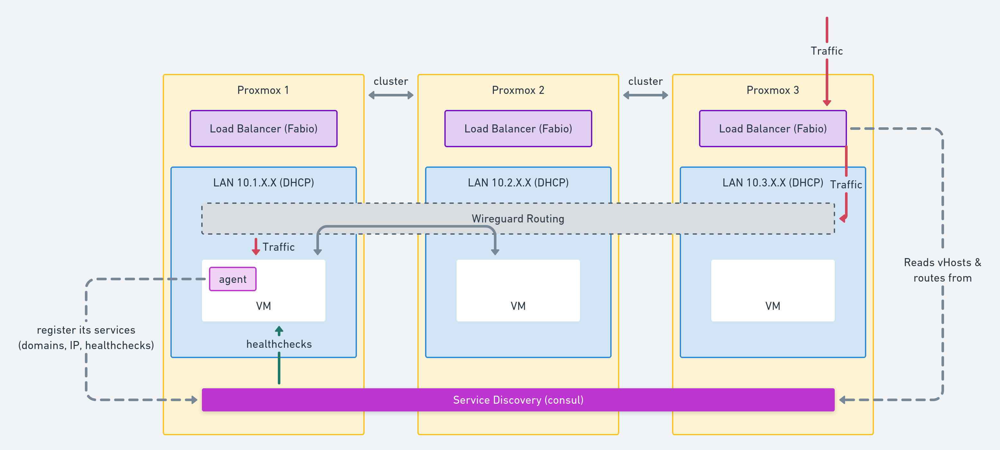

## Introduction

This is the collection of roles I use to deploy & manage a few servers.

This :
* Installs proxmox 6
* Setups NAT-ed LAN for proxmox VTs and VMs (dnsmasq)
* Installs wireguard
* Connects LANs together using wireguard
* Deploys a service-discovery service (consul)
* Deploys load-balancer on each node (fabio)

The setup looks like this:


### Why this setup ?

I've been using Kubernetes for the past 5 years, as a user, as an admin and as an operator developper.
I've spent enough time to know I don't want to maintain a hand-crafted Kubernetes cluster.

Proxmox and VMs were a nice choice because:
* soft multi-tenancy
* hot and cold VM migration since proxmox 6
* does not requires a PhD to interact with the UI -> I can co-host with friends

In order to clusterize the PVEs I needed a common network for the VMs to communicate.
Wireguard allows this without the burden of setting up an openvpn/ipsec/whatever cursed tool.
Each PVE has its own internal network for its VMs. `10.10.<PVE ID>.0/24`.

This left me with a last issue: how to move VMs from a PVE to another while keeping incoming traffic ?
The choice was to set the VM IPs using DHCP and use service discovery to know whom to send traffic to.
I initially wrote a consul-template template to refresh nginx configuration
based on consul's content. In the end it was a clunky version of what fabiolb
did natively so I trashed this code and used fabio as a loadbalancer.

VMs are deployed using ansible. I'm using another VM to provision everyone.
This ansible VM is not deploying the proxmox because of the chicken and egg
problem.

### ToDo

* Setup a by default firewall rejecting everything from the internet except ssh
* setup ssh keyonly (and drop old ciphers).
* secure the consul access
* install prometheus-node-exporter on the VMs and declare it in consul
* set utc everywhere

## Local setup

### Requirements

* python3 with virtualenv (so you don't pollute your system with weird ansible versions)
* Vagrant with Virtalbox provider

### First install

```
vagrant up
# for some reason VM reboot may fail during the initial install, keep ansible running and perform a proper reboot
```

### Connecting web UIs

* https://consul.local.shaka.xyz:8443/
* https://fabio.local.shaka.xyz:8443/
* https://proxmox-morbier.proxmox.local.shaka.xyz:8443/
* https://proxmox-camembert.proxmox.local.shaka.xyz:8443/
* https://proxmox-roquefort.proxmox.local.shaka.xyz:8443/

### Iterating faster

The makefile provides targets that re-use the vagrant-generated inventory.
This is useful to run only specific tags without editing the Vagrantfile.
